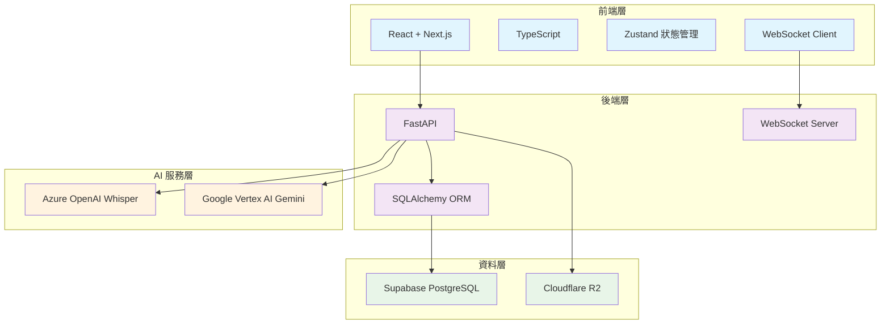

# StudyScriber PRD

---

## 1. 專案願景

提供「邊錄邊轉錄」的雲端筆記，讓內部訓練、講座筆記一次到位：可選錄音、即時逐字稿、Markdown 筆記與匯出，一條龍完成。

---

## 2. 產品定位

| 項目     | 描述                                                               |
| -------- | ------------------------------------------------------------------ |
| 目標族群 | 成年自學者                                                         |
| 痛點     | 備課／聽課同時要做筆記、整理逐字稿耗時、有時只需要筆記功能         |
| 核心價值 | 1 個畫面完成「純筆記」或「錄音 → 即時逐字稿 → 筆記」，課後一鍵匯出 |

---

## 3. 核心功能

### 3.1 雲端 Markdown 筆記系統

**實作狀態：** ✅ 已完成  
**技術實現：** React + Supabase + 自動儲存機制  

**關鍵特性：**
- **即時自動儲存**：筆記內容自動同步至雲端，無需手動儲存
- **時間戳衝突檢測**：UPSERT 邏輯防止多裝置編輯衝突，確保資料一致性
- **離線草稿支援**：網路中斷時支援本地編輯，連線後自動同步
- **Markdown 格式支援**：完整支援 Markdown 語法，提供豐富的文字格式化功能
- **會話級別管理**：每個會話對應一份筆記，支援獨立的內容管理

### 3.2 雙模式錄音與即時轉錄

**實作狀態：** ✅ 已完成  
**技術實現：** WebM 直接轉錄 + WebSocket 即時推送  

**關鍵特性：**
- **雙模式支援**：
  - `note_only` 模式：純筆記編輯，可隨時升級為錄音模式
  - `recording` 模式：同步錄音與筆記編輯功能
- **革命性 WebM 直接轉錄**：跳過 FFmpeg 轉換，直接發送 WebM 至 STT API，減少 60% 處理時間，降低 80% 錯誤率
- **10秒音檔切片**：自動將錄音切分為 10 秒片段，支援背景並行處理
- **即時逐字稿推送**：透過 WebSocket 即時推送轉錄結果，無延遲顯示
- **會話升級機制**：純筆記會話可無縫升級為錄音模式，保持內容連續性

### 3.3 雙引擎語音辨識系統

**實作狀態：** ✅ 已完成  
**技術實現：** Factory Pattern + Provider 統一介面  

**支援引擎：**
- **Whisper (Azure OpenAI)**：高精度語音辨識，適合正式場合
- **Gemini 2.5 Pro (Vertex AI)**：Google 最新語音模型，支援多語言優化

**關鍵特性：**
- **UI 即時切換**：前端提供 Provider 選擇介面，支援即時切換
- **會話級別管理**：每個會話可獨立設定 STT Provider，靈活適應不同需求
- **統一介面設計**：透過 Factory Pattern 實現 Provider 抽象，易於擴展新引擎
- **智能限制機制**：錄音開始後鎖定 Provider 選擇，確保轉錄一致性
- **多語言支援**：支援繁體中文 (zh-TW) 和美式英文 (en-US) 語音辨識

### 3.4 會話管理與狀態控制

**實作狀態：** ✅ 已完成  
**技術實現：** 狀態機 + 資料庫約束機制  

**狀態類型：**
- **會話狀態**：`active` (活躍)、`completed` (已完成)、`error` (錯誤)
- **錄音狀態**：`default` (預設)、`recording_waiting` (等待轉錄)、`recording_active` (錄音中)、`finish` (完成)

**關鍵特性：**
- **單一活躍會話限制**：資料庫觸發器確保同時只有一個活躍會話，避免資源衝突
- **自動狀態轉換**：前端狀態機自動處理狀態轉換邏輯，確保操作流程正確
- **錯誤恢復機制**：網路中斷或轉錄失敗時自動恢復，保障用戶體驗
- **會話生命週期管理**：完整的建立、升級、完成、刪除流程，支援資料完整性
- **級聯刪除保護**：刪除會話時自動清理所有關聯資料 (筆記、音檔、逐字稿)

### 3.5 智能匯出與資料打包

**實作狀態：** ✅ 已完成  
**技術實現：** ZIP 打包 + 時間戳格式化  

**匯出內容：**
- **Markdown 筆記** (`note.md`)：完整的筆記內容，保持原始格式
- **時間戳逐字稿** (`transcript.txt`)：格式化的逐字稿，包含精確時間戳

**關鍵特性：**
- **一鍵 ZIP 匯出**：將筆記和逐字稿打包為單一 ZIP 檔案，便於分享和備份
- **時間戳格式化**：逐字稿採用 `[HH:MM:SS]` 格式，便於定位和回顧
- **完成狀態檢查**：僅允許匯出已完成的會話，確保資料完整性
- **自動檔名生成**：根據會話 ID 和日期自動生成檔名，避免重複
- **串流下載支援**：支援大檔案串流下載，提升用戶體驗

---

## 4. 技術架構

### 4.1 後端技術棧

**核心框架：** FastAPI (Python)  
**資料庫：** Supabase PostgreSQL  
**即時通訊：** WebSocket  

**技術組件：**
```python
FastAPI (Web 框架)
├── SQLAlchemy 2.0 (ORM)
├── Pydantic (資料驗證)
├── WebSocket (即時通訊)
├── Azure OpenAI (Whisper STT)
├── Google Vertex AI (Gemini STT)
├── Cloudflare R2 (音檔儲存)
└── FFmpeg (音檔處理)
```

**關鍵特性：**
- **高效能 API**：FastAPI 提供自動 API 文件生成和高效能非同步處理
- **型別安全**：Pydantic 確保資料驗證和序列化的型別安全
- **即時通訊**：WebSocket 支援即時逐字稿推送和狀態同步
- **多雲整合**：整合 Azure、Google Cloud、Cloudflare 等多雲服務
- **音檔處理**：FFmpeg 支援多格式音檔轉換和處理

### 4.2 前端技術棧

**核心框架：** React + Next.js  
**程式語言：** TypeScript  
**狀態管理：** Zustand  

**技術組件：**
```typescript
React + Next.js (UI 框架)
├── TypeScript (型別安全)
├── Tailwind CSS + shadcn/ui (樣式系統)
├── Zustand (狀態管理)
├── WebSocket Client (即時通訊)
├── MediaRecorder API (音檔錄製)
└── Vitest + Playwright (測試框架)
```

**關鍵特性：**
- **現代化 UI**：React 18 + Next.js 13 提供最新的前端開發體驗
- **型別安全**：TypeScript 確保編譯時型別檢查，減少執行時錯誤
- **響應式設計**：Tailwind CSS + shadcn/ui 提供一致的設計系統
- **輕量狀態管理**：Zustand 提供簡潔的狀態管理解決方案
- **原生音檔錄製**：MediaRecorder API 支援瀏覽器原生音檔錄製

### 4.3 資料庫設計

**資料庫系統：** Supabase PostgreSQL  
**ORM 框架：** SQLAlchemy 2.0  

**核心資料表：**
```sql
sessions (會話管理)
├── id: UUID (主鍵)
├── type: ENUM('note_only', 'recording')
├── status: ENUM('active', 'completed', 'error')
├── title: VARCHAR(255)
├── lang_code: ENUM('zh-TW', 'en-US')
├── stt_provider: ENUM('whisper', 'gemini')
└── timestamps: TIMESTAMP

notes (筆記內容) [1:1 with sessions]
├── id: UUID (主鍵)
├── session_id: UUID (外鍵)
├── content: TEXT (Markdown 內容)
├── client_ts: TIMESTAMP (客戶端時間戳)
└── timestamps: TIMESTAMP

audio_files (音檔切片) [1:N with sessions]
├── id: UUID (主鍵)
├── session_id: UUID (外鍵)
├── chunk_sequence: INTEGER
├── file_path: VARCHAR(500)
├── file_size: BIGINT
└── timestamps: TIMESTAMP

transcript_segments (逐字稿片段) [1:N with sessions]
├── id: UUID (主鍵)
├── session_id: UUID (外鍵)
├── chunk_sequence: INTEGER
├── start_time: DECIMAL (開始時間)
├── end_time: DECIMAL (結束時間)
├── text: TEXT (轉錄文字)
├── confidence: DECIMAL (信心度)
└── timestamps: TIMESTAMP

transcripts (完整逐字稿) [1:1 with sessions]
├── id: UUID (主鍵)
├── session_id: UUID (外鍵)
├── full_text: TEXT (完整逐字稿)
└── timestamps: TIMESTAMP
```

**資料約束與關聯：**
- **外鍵約束**：確保資料完整性和關聯正確性
- **級聯刪除**：刪除會話時自動清理所有關聯資料
- **唯一約束**：確保單一活躍會話限制
- **索引優化**：針對查詢頻繁的欄位建立索引

### 4.4 雲端服務整合

**語音辨識服務：**
- **Azure OpenAI (Whisper)**：
  - 端點：`https://{resource}.openai.azure.com/`
  - 模型：`whisper-1`
  - 支援格式：WebM, MP3, WAV
  - 語言支援：zh-TW, en-US

- **Google Vertex AI (Gemini 2.5 Pro)**：
  - 端點：`https://{region}-aiplatform.googleapis.com/`
  - 模型：`gemini-2.5-pro`
  - 支援格式：WebM, MP3, WAV
  - 語言支援：zh-TW, en-US

**檔案儲存服務：**
- **Cloudflare R2 (可選)**：
  - 音檔切片儲存
  - CDN 加速存取
  - 成本效益優化
  - S3 相容 API

**資料庫服務：**
- **Supabase**：
  - 託管 PostgreSQL
  - 即時資料同步
  - 自動備份機制
  - RESTful API 自動生成

**部署與監控：**
- **後端部署**：支援 Docker 容器化部署
- **前端部署**：Vercel/Netlify 靜態網站部署
- **監控系統**：Supabase 內建監控和日誌系統
- **錯誤追蹤**：整合錯誤監控和效能分析

### 4.5 系統架構圖



**資料流程：**
1. **錄音階段**：前端 MediaRecorder → WebM 切片 → 後端 API
2. **轉錄階段**：音檔切片 → STT 服務 → 逐字稿片段
3. **即時推送**：WebSocket → 前端狀態更新 → UI 渲染
4. **資料儲存**：PostgreSQL 關聯式儲存 + R2 檔案儲存
5. **匯出階段**：資料庫查詢 → ZIP 打包 → 檔案下載

