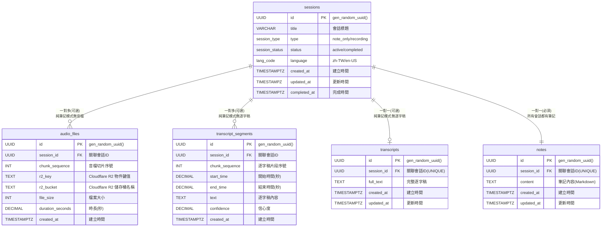

# StudyScriber 

---

## 1. 專案願景

提供「邊錄邊轉錄」的雲端筆記，讓內部訓練、講座筆記一次到位：可選錄音、即時逐字稿、Markdown 筆記與匯出，一條龍完成。

---

## 2. 產品定位

| 項目 | 描述 |
|---|---|
| 目標族群 | 成年自學者 |
| 痛點 | 備課／聽課同時要做筆記、整理逐字稿耗時、有時只需要筆記功能 |
| 核心價值 | 1 個畫面完成「純筆記」或「錄音 → 即時逐字稿 → 筆記」，課後一鍵匯出 |

---

## 3. MVP 功能列表

| 類別 | 功能 | 說明 |
|---|---|---|
| 會話管理 | 建立純筆記或錄音會話 | 支援兩種模式：note_only / recording |
| 錄音 | 桌面瀏覽器錄音、5 s 切片重傳 | 支援 Chrome / Edge / Firefox / macOS Safari |
| 逐字稿 | Azure Whisper 串流，平均延遲 ≤ 3 s | 中文 85 %+ 準確 |
| 筆記 | SimpleMDE Markdown 編輯、10 s Auto-save | 可獨立使用或錄音中同步輸入 |
| 匯出 | 依會話類型匯出：純筆記(.md) 或 完整包(.webm + transcript.txt + note.md) | 離線備份、分享 |
| 隨時可寫草稿 | 會話建立前的標題／筆記暫存在 localStorage | 不怕誤關分頁 |
| 重傳機制 | Chunk 遺失自動補傳，單片最多 5 次 | 網路抖動不掉稿 |


---

## Spec

### 1. 後端 FastAPI

| # | 函式 / 協程 | 所屬模組 | 責任 | I/O |
|---|---|---|---|---|
| B-001 | `create_session(title:str, type:str) -> SessionOut` | api.sessions | POST /api/session | in: title, type；out: sid, status, type |
| B-002 | `finish_session(sid:UUID)` | api.sessions | PATCH /api/session/{sid}/finish | in: sid；204 |
| B-015 | `upgrade_session_to_recording(sid:UUID)` | api.sessions | PATCH /api/session/{sid}/upgrade | in: sid；out: updated session |
| B-003 | `save_note(sid:UUID, content:str, ts:int)` | api.notes | PUT /api/notes/{sid} | in: content, client_ts；out: server_ts |
| B-004 | `export_resource(sid:UUID, type:str)` | api.export | GET /api/export/{sid}?type= | StreamingResponse |
| B-005 | `ws_upload_audio(ws:WebSocket, sid:UUID)` | ws.upload_audio | 上傳音片段、Ack/missing | ↑ binary；↓ {"ack","missing"} |
| B-006 | `ws_transcript_feed(ws:WebSocket, sid:UUID)` | ws.transcript_feed | 推送逐字稿事件 | ↓ {"seq",...} |
| B-007 | `store_chunk_blob(sid, seq, blob)` | services.storage | 上傳到 Cloudflare R2 + 更新 DB `audio_files` | — |
| B-008 | `ffmpeg_spawn() -> Popen` | core.ffmpeg | 建立共用轉碼子行程 | return proc |
| B-009 | `feed_ffmpeg(proc, webm_bytes) -> bytes` | core.ffmpeg | webm→16k mono PCM | in: WebM blob |
| B-010 | `whisper_connect() -> Websocket` | services.stt_adapter | 建立 Whisper WS | return ws |
| B-011 | `whisper_stream(proc, ws, sid)` | services.stt_adapter | PCM→Whisper；收回傳寫 `transcript_segments` | — |
| B-012 | `handle_ack_missing(received:set,int)->dict` | ws.upload_audio | 產生 ack/missing JSON | return {"ack":n,"missing":[..]} |
| B-013 | `mark_session_error(sid, reason)` | db.crud | 更新 sessions.status=error | — |
| B-014 | `single_active_guard()` | middleware | 保證同時僅 1 active session | 429 on violation |
| B-016 | `check_tables_exist()` | db.database | 檢查核心表格是否存在 | return bool |
| B-017 | `auto_init_database()` | db.database | 自動檢測並初始化資料庫 | 啟動時執行 |
| B-018 | `init_r2_client() -> S3Client` | services.r2_client | 初始化 Cloudflare R2 客戶端 | return S3Client |
| B-019 | `generate_r2_presigned_url(bucket, key, expires)` | services.r2_client | 生成 R2 預簽名 URL | return presigned_url |

### 2. 前端 React（Hook / Utility）

| # | 函式 | 模組 | 責任 | I/O |
|---|---|---|---|---|
| F-001 | `useSession.createNoteSession(title)` | hooks/useSession | POST /session (type=note_only) | return sid |
| F-002 | `useSession.upgradeToRecording(sid)` | hooks/useSession | PATCH /session/{sid}/upgrade | return updated session |
| F-003 | `useRecorder.start(title)` | hooks/useRecorder | a. POST /session (type=recording)<br>b. PUT draft note<br>c. 啟 MediaRecorder + WS | return sid |
| F-004 | `useRecorder.stop()` | hooks/useRecorder | 停止錄音、PATCH /finish、關 WS | — |
| F-005 | `sendChunk(seq, blob)` | hooks/useRecorder | 封包 4B seq+blob 上傳 | — |
| F-006 | `handleAckMissing(msg)` | hooks/useRecorder | 1 s debounce 補傳缺片 | — |
| F-007 | `useTranscript.connect(sid)` | hooks/useTranscript | 建 `/ws/transcript_feed` 連線 | — |
| F-008 | `mergeSegment(seg)` | hooks/useTranscript | 相鄰 ≤1 s 合併段落 | 更新 segments state |
| F-009 | `autoScroll()` | hooks/useTranscript | 若鎖定到底則捲底 | — |
| F-010 | `unlockOnScroll()` | hooks/useTranscript | 使用者滾動離底 >60 px | set locked=false |
| F-011 | `toLatest()` | hooks/useTranscript | smooth scroll bottom；鎖定 | — |
| F-012 | `useLocalDraft(field,val)` | hooks/useLocalDraft | 5 s debounce 存 localStorage | — |
| F-013 | `loadDraft()` | hooks/useLocalDraft | 載入 draft_title / draft_note | return {title,note} |
| F-014 | `clearDraft()` | hooks/useLocalDraft | removeItem('draft_*') | — |
| F-015 | `useAutoSave(sid, content)` | hooks/useAutoSave | 每 10 s PUT /notes | — |
| F-016 | `downloadZip(sid)` | utils/export | GET /export/{sid}?type=zip | 觸發 download |
| F-017 | `showToast(text,type)` | utils/ui | 統一錯誤／提示 | — |

### 3. 前端 UI Component Methods

| # | 元件 | 主要方法 / callback |
|---|---|---|
| C-001 | `RecordButton` | `onClick => start() | stop()` |
| C-002 | `TitleInput` | `onChange => saveDraft()` |
| C-003 | `MarkdownEditor` | `onChange => saveDraft() / autoSave()` |
| C-004 | `TranscriptPane` | `onScroll => unlockOnScroll()` |
| C-005 | `ToLatestButton` | `onClick => toLatest()` |
| C-006 | `PaneOverlay` | 無（僅呈現 uploading spinner） |
| C-007 | `SessionModeSelector` | `onChange => createNoteSession() | createRecordingSession()` |
| C-008 | `UpgradeToRecordingButton` | `onClick => upgradeToRecording()` |

### 4. Supabase PostgreSQL 資料庫架構

**架構特色**：
- ✅ **雲端原生**：專為 Supabase 設計，享受完整雲端服務
- ✅ **檔案分離**：音訊檔案使用免費的 Cloudflare R2 儲存，降低成本
- ✅ **自動初始化**：提供完整 SQL 腳本，一鍵建立所有表格
- ✅ **高可用性**：Supabase 提供 99.9% 可用性保證
- ✅ **即時功能**：內建 Realtime 支援，為未來功能做準備



### 5. Cloudflare R2 整合架構

**技術選擇理由**：
- ✅ **免費額度**：每月 10GB 免費儲存空間，無 egress 費用
- ✅ **S3 兼容**：使用標準 AWS S3 SDK，程式碼可攜性佳
- ✅ **全球分佈**：Cloudflare 全球 CDN 網路，存取速度快
- ✅ **成本效益**：相較其他雲端儲存服務，成本更低

**整合配置**：
```python
# Cloudflare R2 設定
R2_ACCOUNT_ID = "your-account-id"
R2_ACCESS_KEY_ID = "your-access-key-id" 
R2_SECRET_ACCESS_KEY = "your-secret-key"
R2_BUCKET_NAME = "studyscriber-audio"
R2_ENDPOINT_URL = f"https://{R2_ACCOUNT_ID}.r2.cloudflarestorage.com"

# AWS S3 Client 配置
import boto3
s3_client = boto3.client(
    's3',
    endpoint_url=R2_ENDPOINT_URL,
    aws_access_key_id=R2_ACCESS_KEY_ID,
    aws_secret_access_key=R2_SECRET_ACCESS_KEY,
    region_name='auto'
)
```

**檔案命名規範**：
```
audio/{session_id}/chunk_{sequence:04d}.webm
例：audio/550e8400-e29b-41d4-a716-446655440000/chunk_0001.webm
```

**初始化腳本**: `app/db/supabase_init.sql`
```sql
-- StudyScriber Supabase 資料庫初始化腳本
-- 建立自定義類型 (Enum)
DO $$ BEGIN
    CREATE TYPE session_type AS ENUM ('note_only', 'recording');
EXCEPTION
    WHEN duplicate_object THEN null;
END $$;

DO $$ BEGIN
    CREATE TYPE session_status AS ENUM ('active', 'completed');
EXCEPTION
    WHEN duplicate_object THEN null;
END $$;

DO $$ BEGIN
    CREATE TYPE lang_code AS ENUM ('zh-TW', 'en-US');
    COMMENT ON TYPE lang_code IS '語言代碼：zh-TW=繁體中文, en-US=美式英文';
EXCEPTION
    WHEN duplicate_object THEN null;
END $$;

-- 建立表格、索引、觸發器...
-- (詳細內容請參考 app/db/supabase_init.sql)
```

---

## 5. 使用場景與狀態流程

### 場景 1：純筆記模式
```
使用者流程：
1. 開啟應用 → 建立 note_only session (status: active)
2. 寫筆記 → 自動儲存到 notes 表
3. 完成 → 狀態轉為 completed
4. 匯出 → 僅包含 note.md

狀態轉換：active → completed
```

### 場景 2：先筆記後錄音
```
使用者流程：
1. 建立 note_only session → 寫筆記
2. 決定錄音 → 升級為 recording session
3. 開始錄音 → 持續 recording 狀態
4. 錄音完成 → completed
5. 匯出 → 包含 note.md + audio.webm + transcript.txt

狀態轉換：active → completed
```

### 場景 3：邊錄邊記
```
使用者流程：
1. 直接建立 recording session
2. 同時錄音和寫筆記
3. 錄音完成 → 自動轉錄
4. 匯出完整資料

狀態轉換：active → completed
```

### 併發控制規則
- 同時只能有一個 active session（透過資料庫觸發器保證）
- 純筆記 session 可以升級為錄音 session
- 錄音 session 無法降級為純筆記 session

# Backlog

## 核心功能
- 帳號登入登出
- 檔案管理，支援一個帳號可以擁有多個筆記

## 基礎設施改進
- Supabase Row Level Security (RLS) 設定
- Cloudflare R2 預簽名 URL 實作，提升安全性
- 即時同步功能 (Supabase Realtime)
- 系統監控與告警
- 效能調優與索引優化
