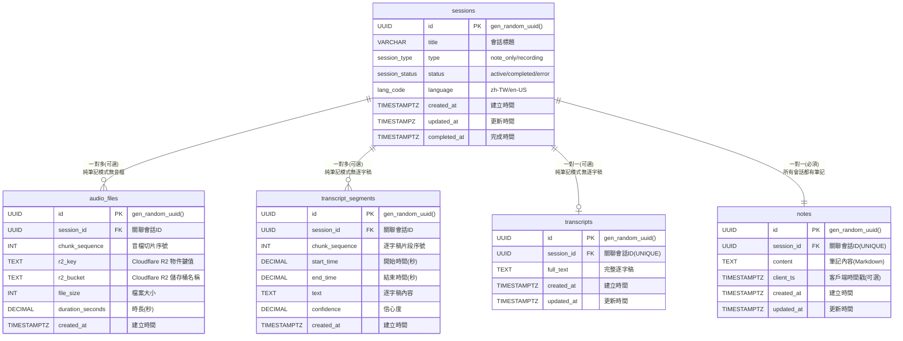

# StudyScriber 

---

## 1. 專案願景

提供「邊錄邊轉錄」的雲端筆記，讓內部訓練、講座筆記一次到位：可選錄音、即時逐字稿、Markdown 筆記與匯出，一條龍完成。

---

## 2. 產品定位

| 項目 | 描述 |
|---|---|
| 目標族群 | 成年自學者 |
| 痛點 | 備課／聽課同時要做筆記、整理逐字稿耗時、有時只需要筆記功能 |
| 核心價值 | 1 個畫面完成「純筆記」或「錄音 → 即時逐字稿 → 筆記」，課後一鍵匯出 |

---

## 3. MVP 功能列表

| 類別 | 功能 | 說明 |
|---|---|---|
| 會話管理 | 建立純筆記或錄音會話 | 支援兩種模式：note_only / recording |
| 錄音 | 桌面瀏覽器錄音、5 s 切片重傳 | 支援 Chrome / Edge / Firefox / macOS Safari |
| 逐字稿 | Azure OpenAI Whisper API，平均延遲 ≤ 12 s | 中文 85 %+ 準確 |
| 筆記 | SimpleMDE Markdown 編輯、10 s Auto-save | 可獨立使用或錄音中同步輸入 |
| 匯出 | 依會話類型匯出：純筆記(.md) 或 完整包(.webm + transcript.txt + note.md) | 離線備份、分享 |
| 隨時可寫草稿 | 會話建立前的標題／筆記暫存在 localStorage | 不怕誤關分頁 |
| 重傳機制 | Chunk 遺失自動補傳，單片最多 5 次 | 網路抖動不掉稿 |


---

## Spec

### 1. 後端 FastAPI

| # | 函式 / 協程 | 所屬模組 | 責任 | I/O |
|---|---|---|---|---|
| B-001 | `create_session(title:str, type:str) -> SessionOut` | api.sessions | POST /api/session | in: title, type；out: sid, status, type |
| B-002 | `finish_session(sid:UUID)` | api.sessions | PATCH /api/session/{sid}/finish | in: sid；204 |
| B-015 | `upgrade_session_to_recording(sid:UUID)` | api.sessions | PATCH /api/session/{sid}/upgrade | in: sid；out: updated session |
| B-003 | `save_note(sid:UUID, content:str, client_ts:datetime)` | api.notes | PUT /api/notes/{sid} | in: content, client_ts(可選)；out: server_ts, note |
| B-004 | `export_resource(sid:UUID, type:str)` | api.export | GET /api/export/{sid}?type= | StreamingResponse |
| B-005 | `ws_upload_audio(ws:WebSocket, sid:UUID)` | ws.upload_audio | 上傳音片段、Ack/missing | ↑ binary；↓ {"ack","missing"} |
| B-006 | `ws_transcript_feed(ws:WebSocket, sid:UUID)` | ws.transcript_feed | 推送 Azure OpenAI 逐字稿結果 | ↓ {"text","timestamp",...} |
| B-007 | `store_chunk_blob(sid, seq, blob)` | services.storage | 上傳到 Cloudflare R2 + 更新 DB `audio_files` | — |
| B-008 | `ffmpeg_spawn() -> Popen` | core.ffmpeg | 建立共用轉碼子行程 | return proc |
| B-009 | `feed_ffmpeg(proc, webm_bytes) -> bytes` | core.ffmpeg | webm→16k mono PCM | in: WebM blob |
| B-010 | `azure_openai_client() -> OpenAI` | services.azure_openai | 建立 Azure OpenAI 客戶端 | return client |
| B-011 | `transcribe_audio_batch(client, audio_chunks, sid)` | services.azure_openai | 批次處理音檔到 Azure OpenAI Whisper；透過 WebSocket 推送結果 | — |
| B-012 | `handle_ack_missing(received:set,int)->dict` | ws.upload_audio | 產生 ack/missing JSON | return {"ack":n,"missing":[..]} |
| B-013 | `mark_session_error(sid, reason)` | db.crud | 更新 sessions.status=error | — |
| B-014 | `single_active_guard()` | middleware | 保證同時僅 1 active session | 429 on violation |
| B-016 | `check_tables_exist()` | db.database | 檢查核心表格是否存在 | return bool |
| B-017 | `auto_init_database()` | db.database | 自動檢測並初始化資料庫 | 啟動時執行 |
| B-018 | `init_r2_client() -> S3Client` | services.r2_client | 初始化 Cloudflare R2 客戶端 | return S3Client |
| B-019 | `generate_r2_presigned_url(bucket, key, expires)` | services.r2_client | 生成 R2 預簽名 URL | return presigned_url |

### 2. 前端 React（Hook / Utility）

| # | 函式 | 模組 | 責任 | I/O |
|---|---|---|---|---|
| F-001 | `useAppState.setState(state)` | hooks/useAppState | 管理前端應用狀態轉換 | 'default'\|'recording'\|'processing'\|'finished' |
| F-002 | `useSession.createNoteSession(title)` | hooks/useSession | POST /session (type=note_only) | return sid |
| F-003 | `useSession.upgradeToRecording(sid)` | hooks/useSession | PATCH /session/{sid}/upgrade | return updated session |
| F-004 | `useRecorder.startRecording(title?)` | hooks/useRecorder | a. 建立/升級 session<br>b. 狀態轉為 recording<br>c. 啟 MediaRecorder + WS | return sid |
| F-005 | `useRecorder.stopRecording()` | hooks/useRecorder | a. 停止錄音<br>b. 狀態轉為 processing<br>c. 等待轉錄完成 | — |
| F-006 | `sendChunk(seq, blob)` | hooks/useRecorder | 封包 4B seq+blob 上傳 | — |
| F-007 | `handleAckMissing(msg)` | hooks/useRecorder | 1 s debounce 補傳缺片 | — |
| F-008 | `useTranscript.connect(sid)` | hooks/useTranscript | 建 `/ws/transcript_feed` 連線 | — |
| F-009 | `mergeSegment(seg)` | hooks/useTranscript | 相鄰 ≤1 s 合併段落 | 更新 segments state |
| F-010 | `onTranscriptComplete()` | hooks/useTranscript | 轉錄完成回調，狀態轉為 finished | — |
| F-011 | `autoScroll()` | hooks/useTranscript | 若鎖定到底則捲底 | — |
| F-012 | `unlockOnScroll()` | hooks/useTranscript | 使用者滾動離底 >60 px | set locked=false |
| F-013 | `toLatest()` | hooks/useTranscript | smooth scroll bottom；鎖定 | — |
| F-014 | `useLocalDraft(field,val)` | hooks/useLocalDraft | 5 s debounce 存 localStorage | — |
| F-015 | `loadDraft()` | hooks/useLocalDraft | 載入 draft_title / draft_note | return {title,note} |
| F-016 | `clearDraft()` | hooks/useLocalDraft | removeItem('draft_*') | — |
| F-017 | `useAutoSave(sid, content)` | hooks/useAutoSave | 每 10 s PUT /notes | — |
| F-018 | `newNote()` | hooks/useAppState | 清空當前資料，狀態回到 default | — |
| F-019 | `downloadZip(sid)` | utils/export | GET /export/{sid}?type=zip | 觸發 download |
| F-020 | `showToast(text,type)` | utils/ui | 統一錯誤／提示 | — |

### 3. 前端 UI Component Methods（狀態對應）

| # | 元件 | 出現狀態 | 主要方法 / callback |
|---|---|---|---|
| C-001 | `RecordButton` | default, recording | `onClick => startRecording() | stopRecording()` |
| C-002 | `TitleInput` | default | `onChange => saveDraft()` |
| C-003 | `MarkdownEditor` | default, recording, finished | `onChange => saveDraft() / autoSave()` |
| C-004 | `TranscriptPane` | recording, processing, finished | `onScroll => unlockOnScroll()` |
| C-005 | `ToLatestButton` | recording, finished | `onClick => toLatest()` |
| C-006 | `ProcessingOverlay` | processing | 顯示轉錄進度與等待動畫 |
| C-007 | `ExportButton` | finished | `onClick => downloadZip()` |
| C-008 | `NewNoteButton` | finished | `onClick => newNote()` |
| C-009 | `StatusIndicator` | all states | 顯示當前狀態（錄音中/處理中/已完成） |

**各狀態畫面組成**：

| 狀態 | 顯示元件 |
|---|---|
| default | TitleInput + MarkdownEditor + RecordButton + NewNoteButton |
| recording | MarkdownEditor + TranscriptPane +  + NewNoteButton + RecordButton(停止) + ToLatestButton |
| processing | MarkdownEditor + TranscriptPane + ProcessingOverlay |
| finished | MarkdownEditor + TranscriptPane + ExportButton + NewNoteButton + ToLatestButton |

### 4. Supabase PostgreSQL 資料庫架構

**架構特色**：
- ✅ **雲端原生**：專為 Supabase 設計，享受完整雲端服務
- ✅ **檔案分離**：音訊檔案使用免費的 Cloudflare R2 儲存，降低成本
- ✅ **自動初始化**：提供完整 SQL 腳本，一鍵建立所有表格
- ✅ **高可用性**：Supabase 提供 99.9% 可用性保證
- ✅ **即時功能**：內建 Realtime 支援，為未來功能做準備



### 5. 前端狀態管理

**前端應用狀態 (AppState)**：
```typescript
type AppState = 
  | 'default'     // 預設畫面：可寫筆記，顯示錄音按鈕
  | 'recording'   // 錄音畫面：錄音中，即時顯示逐字稿
  | 'processing'  // 處理畫面：停止錄音後，處理剩餘逐字稿
  | 'finished'    // 完整逐字稿畫面：可編輯筆記、匯出、開新筆記
```

**狀態轉換規則**：
```
default → recording     // 按下錄音按鈕
recording → processing  // 按下停止錄音
processing → finished   // 逐字稿處理完成
finished → default      // 按下 New note
default → finished      // 純筆記模式直接完成（未來功能）
```

**各狀態功能對照**：

| 狀態 | 筆記編輯 | 錄音功能 | 逐字稿顯示 | 匯出功能 | 特殊功能 |
|---|---|---|---|---|---|
| default | ✅ 可編輯 | ✅ 可開始 | ❌ 無 | ❌ 無 | draft 暫存 |
| recording | ✅ 可編輯 | ✅ 可停止 | ✅ 即時顯示 | ❌ 無 | 音檔上傳 |
| processing | ❌ 鎖定 | ❌ 無 | ✅ 更新中 | ❌ 無 | 等待動畫 |
| finished | ✅ 可編輯 | ❌ 無 | ✅ 完整顯示 | ✅ 可匯出 | New note |

**後端 Session 狀態對應**：

| 前端狀態 | 後端 Session Status | Session Type | 說明 |
|---|---|---|---|
| default | draft | note_only | 草稿狀態，尚未正式建立 session |
| default (已建立) | active | note_only | 純筆記 session |
| recording | active | recording | 錄音 session |
| processing | active | recording | 錄音結束，轉錄處理中 |
| finished | completed | note_only/recording | 可匯出完整資料 |

### 6. Azure OpenAI 整合架構

**技術選擇理由**：
- ✅ **企業級品質**：Azure OpenAI 提供穩定的 Whisper 模型服務
- ✅ **多語言支援**：優秀的中文語音識別準確度
- ✅ **API 整合**：標準 OpenAI SDK，開發簡單
- ✅ **資料安全**：Microsoft 提供企業級資料保護

**工作流程**：
```
前端錄音 → WebSocket 即時上傳音片段 → 儲存到 R2 → 
累積一定數量後批次發送給 Azure OpenAI → WebSocket 推送轉錄結果
```

**整合配置**：
```python
# Azure OpenAI 設定
AZURE_OPENAI_API_KEY = "your-api-key"
AZURE_OPENAI_ENDPOINT = "https://your-resource.openai.azure.com/"
AZURE_OPENAI_API_VERSION = "2024-02-01"
WHISPER_DEPLOYMENT_NAME = "whisper-1"  # 您的部署名稱

# OpenAI Client 配置
from openai import AzureOpenAI
client = AzureOpenAI(
    api_key=AZURE_OPENAI_API_KEY,
    api_version=AZURE_OPENAI_API_VERSION,
    azure_endpoint=AZURE_OPENAI_ENDPOINT
)

# 批次處理設定
BATCH_SIZE = 3  # 每 3 個音檔切片進行一次轉錄
BATCH_TIMEOUT = 10  # 最多等待 10 秒進行批次處理
```

---

## 8. 使用場景與狀態流程

### 場景 1：純筆記模式（不錄音）

- **目標**：讓使用者能快速開始做筆記，無需進行繁瑣的設定。
- **流程**：
  1. **進入頁面**：使用者打開應用，看到預設畫面（`default` 狀態）。
  2. **輸入標題與內容**：
     - 在 `TitleInput` 中輸入標題，內容暫存於 `localStorage`（`draft_title`）。
     - 在 `MarkdownEditor` 中輸入筆記，內容暫存於 `localStorage`（`draft_note`）。
  3. **建立會話**：
     - 使用者首次輸入時，自動觸發 `createNoteSession(title)`，在後端建立一個 `note_only` 類型的 session。
     - 成功後，`useAutoSave` hook 啟動，每 10 秒將筆記內容同步到後端。
  4. **完成筆記**：
     - 使用者可以隨時離開，筆記已儲存。
     - （未來功能）可手動點擊「完成」，將 session 狀態改為 `completed`。

### 場景 2：先筆記後錄音

- **目標**：允許使用者在已有筆記的基礎上，隨時開始錄音。
- **流程**：
  1. **開始筆記**：同「場景 1」，使用者已建立一個 `note_only` 會話並有一些筆記內容。
  2. **點擊錄音**：使用者點擊 `RecordButton`。
  3. **升級會話**：
     - 呼叫 `upgradeToRecording()`，將後端 session type 從 `note_only` 改為 `recording`。
     - 前端狀態從 `default` 轉為 `recording`。
  4. **開始錄音**：同「場景 3」的錄音流程。

### 場景 3：邊錄邊記模式

- **目標**：提供最核心的「錄音 + 即時逐字稿 + 筆記」整合體驗。
- **流程**：
  1. **建立會話**：
     - 使用者在 `default` 狀態下，不輸入任何內容，直接點擊 `RecordButton`。
     - 彈出對話框要求輸入標題。
     - 呼叫 `createRecordingSession(title)` 建立 `recording` 類型的 session。
     - 前端狀態立即轉為 `recording`。
  2. **錄音與上傳**：
     - `MediaRecorder` 開始錄音，每 12 秒產生一個 `.webm` 音檔切片。
     - `ws_upload_audio` WebSocket 連線建立，音檔切片即時上傳。
     - 後端回傳 `ack/missing` 確認，前端處理重傳。
  3. **即時逐字稿**：
     - `ws_transcript_feed` WebSocket 連線建立。
     - 後端在收到足夠的音檔後（例如 3 個），批次發送給 Azure OpenAI Whisper API。
     - Whisper API 返回轉錄結果，後端立即透過 WebSocket 推送給前端。
     - `TranscriptPane` 即時顯示收到的逐字稿片段。
  4. **同步筆記**：
     - 使用者可以在 `MarkdownEditor` 中隨時輸入筆記，`useAutoSave` 會定期儲存。
  5. **停止錄音**：
     - 使用者點擊 `RecordButton` (此時為停止圖示)。
     - `stopRecording()` 被呼叫，`MediaRecorder` 停止。
     - 前端狀態轉為 `processing`。
  6. **等待轉錄完成**：
     - `ProcessingOverlay` 顯示，鎖定編輯區。
     - 後端處理剩餘的音檔切片，並將最後的逐字稿推送回來。
  7. **完成**：
     - 當後端推送 `transcript_complete` 訊息時，前端狀態轉為 `finished`。
     - `ProcessingOverlay` 消失，使用者可以檢視完整逐字稿、編輯筆記、並匯出。
  8. **匯出與新筆記**：
     - `ExportButton` 可用，點擊下載包含 `.webm`、`transcript.txt` 和 `note.md` 的 ZIP 檔。
     - `NewNoteButton` 可用，點擊清空當前畫面，回到 `default` 狀態，開始新的筆記。
