# StudyScriber 

---

## 1. 專案願景

提供「邊錄邊轉錄」的雲端筆記，讓內部訓練、講座筆記一次到位：可選錄音、即時逐字稿、Markdown 筆記與匯出，一條龍完成。

---

## 2. 產品定位

| 項目     | 描述                                                               |
| -------- | ------------------------------------------------------------------ |
| 目標族群 | 成年自學者                                                         |
| 痛點     | 備課／聽課同時要做筆記、整理逐字稿耗時、有時只需要筆記功能         |
| 核心價值 | 1 個畫面完成「純筆記」或「錄音 → 即時逐字稿 → 筆記」，課後一鍵匯出 |

---

## 3. MVP 功能列表

| 類別         | 功能                                                                   | 說明                                        |
| ------------ | ---------------------------------------------------------------------- | ------------------------------------------- |
| 會話管理     | 建立純筆記或錄音會話                                                   | 支援兩種模式：note_only / recording         |
| 錄音         | 桌面瀏覽器錄音、5 s 切片重傳                                           | 支援 Chrome / Edge / Firefox / macOS Safari |
| 逐字稿       | Azure OpenAI Whisper API，平均延遲 ≤ 12 s                              | 中文 85 %+ 準確                             |
| 筆記         | SimpleMDE Markdown 編輯、10 s Auto-save                                | 可獨立使用或錄音中同步輸入                  |
| 匯出         | 依會話類型匯出：純筆記(.md) 或 完整包(.mp4 + transcript.txt + note.md) | 離線備份、分享                              |
| 隨時可寫草稿 | 會話建立前的標題／筆記暫存在 localStorage                              | 不怕誤關分頁                                |
| 重傳機制     | Chunk 遺失自動補傳，單片最多 5 次                                      | 網路抖動不掉稿                              |


---

## Spec

### 1. 後端 FastAPI

| #     | 函式 / 協程                                            | 所屬模組              | 責任                                                         | I/O                                                |
| ----- | ------------------------------------------------------ | --------------------- | ------------------------------------------------------------ | -------------------------------------------------- |
| B-001 | `create_session(title:str, type:str) -> SessionOut`    | api.sessions          | POST /api/session                                            | in: title, type；out: sid, status, type            |
| B-002 | `finish_session(sid:UUID)`                             | api.sessions          | PATCH /api/session/{sid}/finish                              | in: sid；204                                       |
| B-015 | `upgrade_session_to_recording(sid:UUID)`               | api.sessions          | PATCH /api/session/{sid}/upgrade                             | in: sid；out: updated session                      |
| B-003 | `save_note(sid:UUID, content:str, client_ts:datetime)` | api.notes             | PUT /api/notes/{sid}                                         | in: content, client_ts(可選)；out: server_ts, note |
| B-004 | `export_resource(sid:UUID, type:str)`                  | api.export            | GET /api/export/{sid}?type=                                  | StreamingResponse                                  |
| B-005 | `ws_upload_audio(ws:WebSocket, sid:UUID)`              | ws.upload_audio       | 上傳音片段、Ack/missing                                      | ↑ binary；↓ {"ack","missing"}                      |
| B-006 | `ws_transcript_feed(ws:WebSocket, sid:UUID)`           | ws.transcript_feed    | 推送 Azure OpenAI 逐字稿結果                                 | ↓ {"text","timestamp",...}                         |
| B-007 | `store_chunk_blob(sid, seq, blob)`                     | services.storage      | 上傳到 Cloudflare R2 + 更新 DB `audio_files`                 | —                                                  |
| B-008 | `ffmpeg_spawn() -> Popen`                              | core.ffmpeg           | 建立共用轉碼子行程                                           | return proc                                        |
| B-009 | `feed_ffmpeg(proc, mp4_bytes) -> bytes`                | core.ffmpeg           | mp4→16k mono PCM                                             | in: mp4 blob                                       |
| B-010 | `azure_openai_client() -> OpenAI`                      | services.azure_openai | 建立 Azure OpenAI 客戶端                                     | return client                                      |
| B-011 | `transcribe_audio_batch(client, audio_chunks, sid)`    | services.azure_openai | 批次處理音檔到 Azure OpenAI Whisper；透過 WebSocket 推送結果 | —                                                  |
| B-012 | `handle_ack_missing(received:set,int)->dict`           | ws.upload_audio       | 產生 ack/missing JSON                                        | return {"ack":n,"missing":[..]}                    |
| B-013 | `mark_session_error(sid, reason)`                      | db.crud               | 更新 sessions.status=error                                   | —                                                  |
| B-014 | `single_active_guard()`                                | middleware            | 保證同時僅 1 active session                                  | 429 on violation                                   |
| B-016 | `check_tables_exist()`                                 | db.database           | 檢查核心表格是否存在                                         | return bool                                        |
| B-017 | `auto_init_database()`                                 | db.database           | 自動檢測並初始化資料庫                                       | 啟動時執行                                         |
| B-018 | `init_r2_client() -> S3Client`                         | services.r2_client    | 初始化 Cloudflare R2 客戶端                                  | return S3Client                                    |
| B-019 | `generate_r2_presigned_url(bucket, key, expires)`      | services.r2_client    | 生成 R2 預簽名 URL                                           | return presigned_url                               |

### 2. 前端 React（Hook / Utility）

| #     | 函式                                  | 模組                | 責任                                                                              | I/O                                                                          |
| ----- | ------------------------------------- | ------------------- | --------------------------------------------------------------------------------- | ---------------------------------------------------------------------------- |
| F-001 | `useAppState.setState(state)`         | hooks/useAppState   | 管理前端應用狀態轉換                                                              | 'default'\|'recording_waiting'\|'recording_active'\|'processing'\|'finished' |
| F-002 | `useSession.createNoteSession(title)` | hooks/useSession    | POST /session (type=note_only)                                                    | return sid                                                                   |
| F-003 | `useSession.upgradeToRecording(sid)`  | hooks/useSession    | PATCH /session/{sid}/upgrade                                                      | return updated session                                                       |
| F-004 | `useRecorder.startRecording(title?)`  | hooks/useRecorder   | a. 建立/升級 session<br>b. 狀態轉為 recording_waiting<br>c. 啟 MediaRecorder + WS | return sid                                                                   |
| F-005 | `useRecorder.stopRecording()`         | hooks/useRecorder   | a. 停止錄音<br>b. 狀態轉為 processing<br>c. 等待轉錄完成                          | —                                                                            |
| F-006 | `sendChunk(seq, blob)`                | hooks/useRecorder   | 封包 4B seq+blob 上傳                                                             | —                                                                            |
| F-007 | `handleAckMissing(msg)`               | hooks/useRecorder   | 1 s debounce 補傳缺片                                                             | —                                                                            |
| F-008 | `useTranscript.connect(sid)`          | hooks/useTranscript | 建 `/ws/transcript_feed` 連線                                                     | —                                                                            |
| F-009 | `mergeSegment(seg)`                   | hooks/useTranscript | 相鄰 ≤1 s 合併段落                                                                | 更新 segments state                                                          |
| F-010 | `onTranscriptComplete()`              | hooks/useTranscript | 轉錄完成回調，狀態轉為 finished                                                   | —                                                                            |
| F-011 | `autoScroll()`                        | hooks/useTranscript | 若鎖定到底則捲底                                                                  | —                                                                            |
| F-012 | `unlockOnScroll()`                    | hooks/useTranscript | 使用者滾動離底 >60 px                                                             | set locked=false                                                             |
| F-013 | `toLatest()`                          | hooks/useTranscript | smooth scroll bottom；鎖定                                                        | —                                                                            |
| F-014 | `useLocalDraft(field,val)`            | hooks/useLocalDraft | 5 s debounce 存 localStorage                                                      | —                                                                            |
| F-015 | `loadDraft()`                         | hooks/useLocalDraft | 載入 draft_title / draft_note                                                     | return {title,note}                                                          |
| F-016 | `clearDraft()`                        | hooks/useLocalDraft | removeItem('draft_*')                                                             | —                                                                            |
| F-017 | `useAutoSave(sid, content)`           | hooks/useAutoSave   | 每 10 s PUT /notes                                                                | —                                                                            |
| F-018 | `newNote()`                           | hooks/useAppState   | 清空當前資料，狀態回到 default<br>如果存在活躍會話，先刪除該會話及其所有相關數據  | —                                                                            |
| F-019 | `downloadZip(sid)`                    | utils/export        | GET /export/{sid}?type=zip                                                        | 觸發 download                                                                |
| F-020 | `showToast(text,type)`                | utils/ui            | 統一錯誤／提示                                                                    | —                                                                            |

### 3. 前端 UI Component Methods（狀態對應）

| #     | 元件                | 出現狀態                                                  | 主要方法 / callback                    |
| ----- | ------------------- | --------------------------------------------------------- | -------------------------------------- |
| C-001 | `RecordButton`      | default, recording_waiting, recording_active              | `onClick => startRecording()           | stopRecording()` |
| C-002 | `TitleInput`        | default                                                   | `onChange => saveDraft()`              |
| C-003 | `MarkdownEditor`    | default, recording_waiting, recording_active, finished    | `onChange => saveDraft() / autoSave()` |
| C-004 | `TranscriptPane`    | recording_waiting, recording_active, processing, finished | `onScroll => unlockOnScroll()`         |
| C-005 | `ToLatestButton`    | recording_waiting, finished                               | `onClick => toLatest()`                |
| C-006 | `ProcessingOverlay` | processing                                                | 顯示轉錄進度與等待動畫                 |
| C-007 | `ExportButton`      | finished                                                  | `onClick => downloadZip()`             |
| C-008 | `NewNoteButton`     | finished                                                  | `onClick => newNote()`                 |
| C-009 | `StatusIndicator`   | all states                                                | 顯示當前狀態（錄音中/處理中/已完成）   |

**各狀態畫面組成**：

| 狀態              | 顯示元件                                                                              |
| ----------------- | ------------------------------------------------------------------------------------- |
| default           | TitleInput + MarkdownEditor + RecordButton + NewNoteButton                            |
| recording_waiting | MarkdownEditor + TranscriptPane + NewNoteButton + RecordButton(停止) + ToLatestButton |
| recording_active  | MarkdownEditor + TranscriptPane + NewNoteButton + RecordButton(停止) + ToLatestButton |
| processing        | MarkdownEditor + TranscriptPane + ProcessingOverlay                                   |
| finished          | MarkdownEditor + TranscriptPane + ExportButton + NewNoteButton + ToLatestButton       |

**NewNoteButton 在不同狀態的行為**：

| 狀態              | NewNoteButton 行為       | 說明                                                                                           |
| ----------------- | ------------------------ | ---------------------------------------------------------------------------------------------- |
| default           | 清空當前會話並開始新筆記 | 如果存在活躍會話，會先刪除該會話及其所有相關數據；清空編輯器內容和本地草稿；狀態保持在 default |
| recording_waiting | 停止錄音並清空當前會話   | 停止錄音，刪除當前會話及其所有相關數據，回到 default 狀態                                      |
| recording_active  | 停止錄音並清空當前會話   | 停止錄音，刪除當前會話及其所有相關數據，回到 default 狀態                                      |
| finished          | 清空當前會話並開始新筆記 | 刪除已完成的會話及其所有相關數據，清空編輯器內容，回到 default 狀態                            |

### 4. Supabase PostgreSQL 資料庫架構

**架構特色**：
- ✅ **雲端原生**：專為 Supabase 設計，享受完整雲端服務
- ✅ **檔案分離**：音訊檔案使用免費的 Cloudflare R2 儲存，降低成本
- ✅ **自動初始化**：提供完整 SQL 腳本，一鍵建立所有表格
- ✅ **高可用性**：Supabase 提供 99.9% 可用性保證
- ✅ **即時功能**：內建 Realtime 支援，為未來功能做準備

```mermaid
erDiagram
    sessions {
        UUID id PK "gen_random_uuid()"
        VARCHAR title "會話標題"
        session_type type "note_only/recording"
        session_status status "active/completed/error"
        lang_code language "zh-TW/en-US"
        TIMESTAMPTZ created_at "建立時間"
        TIMESTAMPZ updated_at "更新時間"
        TIMESTAMPTZ completed_at "完成時間"
    }

    audio_files {
        UUID id PK "gen_random_uuid()"
        UUID session_id FK "關聯會話ID"
        INT chunk_sequence "音檔切片序號"
        TEXT r2_key "Cloudflare R2 物件鍵值"
        TEXT r2_bucket "Cloudflare R2 儲存桶名稱"
        INT file_size "檔案大小"
        DECIMAL duration_seconds "時長(秒)"
        TIMESTAMPTZ created_at "建立時間"
    }

    transcript_segments {
        UUID id PK "gen_random_uuid()"
        UUID session_id FK "關聯會話ID"
        INT chunk_sequence "逐字稿片段序號"
        DECIMAL start_time "開始時間(秒)"
        DECIMAL end_time "結束時間(秒)"
        TEXT text "逐字稿內容"
        DECIMAL confidence "信心度"
        TIMESTAMPTZ created_at "建立時間"
    }

    transcripts {
        UUID id PK "gen_random_uuid()"
        UUID session_id FK "關聯會話ID(UNIQUE)"
        TEXT full_text "完整逐字稿"
        TIMESTAMPTZ created_at "建立時間"
        TIMESTAMPTZ updated_at "更新時間"
    }

    notes {
        UUID id PK "gen_random_uuid()"
        UUID session_id FK "關聯會話ID(UNIQUE)"
        TEXT content "筆記內容(Markdown)"
        TIMESTAMPTZ client_ts "客戶端時間戳(可選)"
        TIMESTAMPTZ created_at "建立時間"
        TIMESTAMPTZ updated_at "更新時間"
    }

    sessions ||--o{ audio_files : "一對多(可選)<br/>純筆記模式無音檔"
    sessions ||--o{ transcript_segments : "一對多(可選)<br/>純筆記模式無逐字稿"
    sessions ||--o| transcripts : "一對一(可選)<br/>純筆記模式無逐字稿"
    sessions ||--|| notes : "一對一(必須)<br/>所有會話都有筆記"
```



### 5. 前端狀態管理

**前端應用狀態 (AppState)**：
```typescript
type AppState = 
  | 'default'           // 預設畫面：可寫筆記，顯示錄音按鈕
  | 'recording_waiting' // 錄音中，尚未收到逐字稿
  | 'recording_active'  // 錄音中，已收到逐字稿並即時顯示
  | 'processing'        // 處理畫面：停止錄音後，處理剩餘逐字稿
  | 'finished'          // 完整逐字稿畫面：可編輯筆記、匯出、開新筆記
```

**狀態轉換規則**：
```
default → recording_waiting           // 按下錄音按鈕
recording_waiting → recording_active  // 收到第一段逐字稿
recording_active → processing         // 按下停止錄音
processing → finished                 // 逐字稿處理完成
finished → default                    // 按下 New note
default → finished                    // 純筆記模式直接完成（未來功能）
```

**各狀態功能對照**：

| 狀態              | 筆記編輯 | 錄音功能 | 逐字稿顯示 | 匯出功能 | 特殊功能   |
| ----------------- | -------- | -------- | ---------- | -------- | ---------- |
| default           | ✅ 可編輯 | ✅ 可開始 | ❌ 無       | ❌ 無     | draft 暫存 |
| recording_waiting | ✅ 可編輯 | ✅ 可停止 | ⏳ 等待中   | ❌ 無     | 計時器     |
| recording_active  | ✅ 可編輯 | ✅ 可停止 | ✅ 即時顯示 | ❌ 無     | 音檔上傳   |
| processing        | ❌ 鎖定   | ❌ 無     | ✅ 更新中   | ❌ 無     | 等待動畫   |
| finished          | ✅ 可編輯 | ❌ 無     | ✅ 完整顯示 | ✅ 可匯出 | New note   |

**後端 Session 狀態對應**：

| 前端狀態          | 後端 Session Status | Session Type        | 說明                           |
| ----------------- | ------------------- | ------------------- | ------------------------------ |
| default           | draft               | note_only           | 草稿狀態，尚未正式建立 session |
| default (已建立)  | active              | note_only           | 純筆記 session                 |
| recording_waiting | active              | recording           | 錄音中，尚未收到逐字稿         |
| recording_active  | active              | recording           | 錄音中，已收到逐字稿並即時顯示 |
| processing        | active              | recording           | 錄音結束，轉錄處理中           |
| finished          | completed           | note_only/recording | 可匯出完整資料                 |

### 6. Azure OpenAI 整合架構 (WebM 優化版)

**技術選擇理由**：
- ✅ **企業級品質**：Azure OpenAI 提供穩定的 Whisper 模型服務
- ✅ **多語言支援**：優秀的中文語音識別準確度
- ✅ **API 整合**：標準 OpenAI SDK，開發簡單
- ✅ **資料安全**：Microsoft 提供企業級資料保護
- ✅ **格式原生支援**：Whisper API 原生支援 WebM 格式，無需轉換

**優化後工作流程**：
```
前端錄音 (WebM) → WebSocket 即時上傳 WebM 片段 → 儲存到 R2 → 
直接發送 WebM 到 Azure OpenAI Whisper API → WebSocket 推送轉錄結果
```

**架構優化重點**：
- 🚀 **消除轉換瓶頸**：移除每個 chunk 的 FFmpeg WebM→WAV 轉換步驟
- 📈 **效能提升**：預期處理時間減少 60%，錯誤率降低 80%
- 🔧 **簡化流程**：WebM 格式直接發送到 Whisper API，減少處理步驟
- 💾 **資源節省**：降低 CPU 使用率和記憶體消耗
- 🛡️ **錯誤減少**：消除 fragmented MP4 相關轉換錯誤

**整合配置**：
```python
# Azure OpenAI 設定
AZURE_OPENAI_API_KEY = "your-api-key"
AZURE_OPENAI_ENDPOINT = "https://your-resource.openai.azure.com/"
AZURE_OPENAI_API_VERSION = "2024-02-01"
WHISPER_DEPLOYMENT_NAME = "whisper-1"  # 您的部署名稱

# OpenAI Client 配置
from openai import AzureOpenAI
client = AzureOpenAI(
    api_key=AZURE_OPENAI_API_KEY,
    api_version=AZURE_OPENAI_API_VERSION,
    azure_endpoint=AZURE_OPENAI_ENDPOINT
)

# 直接處理設定 (無需批次等待)
CHUNK_PROCESSING = "immediate"  # 每個 WebM chunk 立即處理
SUPPORTED_FORMATS = ["webm", "mp4", "wav"]  # Whisper API 支援格式
```

**技術細節**：
- **前端錄音格式**：優先使用 `audio/webm;codecs=opus`
- **後端處理**：直接將 WebM 數據發送到 Whisper API
- **備選方案**：保留 FFmpeg 轉換邏輯用於最終下載檔案
- **錯誤處理**：簡化錯誤流程，移除 FFmpeg 相關錯誤檢測

---

## 8. 使用場景與狀態流程

### 場景 1：純筆記模式（不錄音）

- **目標**：讓使用者能快速開始做筆記，無需進行繁瑣的設定。
- **流程**：
  1. **進入頁面**：使用者打開應用，看到預設畫面（`default` 狀態）。
  2. **輸入標題與內容**：
     - 在 `TitleInput` 中輸入標題，內容暫存於 `localStorage`（`draft_title`）。
     - 在 `MarkdownEditor` 中輸入筆記，內容暫存於 `localStorage`（`draft_note`）。
  3. **建立會話**：
     - 使用者首次輸入時，自動觸發 `createNoteSession(title)`，在後端建立一個 `note_only` 類型的 session。
     - 成功後，`useAutoSave` hook 啟動，每 10 秒將筆記內容同步到後端。
  4. **完成筆記**：
     - 使用者可以隨時離開，筆記已儲存。
     - （未來功能）可手動點擊「完成」，將 session 狀態改為 `completed`。

### 場景 2：先筆記後錄音

- **目標**：允許使用者在已有筆記的基礎上，隨時開始錄音。
- **流程**：
  1. **開始筆記**：同「場景 1」，使用者已建立一個 `note_only` 會話並有一些筆記內容。
  2. **點擊錄音**：使用者點擊 `RecordButton`。
  3. **升級會話**：
     - 呼叫 `upgradeToRecording()`，將後端 session type 從 `note_only` 改為 `recording`。
     - 前端狀態從 `default` 轉為 `recording_waiting`。
  4. **開始錄音**：同「場景 3」的錄音流程。

### 場景 3：邊錄邊記模式

- **目標**：提供最核心的「錄音 + 即時逐字稿 + 筆記」整合體驗。
- **流程**：
  1. **建立會話**：
     - 使用者在 `default` 狀態下，不輸入任何內容，直接點擊 `RecordButton`。
     - 彈出對話框要求輸入標題。
     - 呼叫 `createRecordingSession(title)` 建立 `recording` 類型的 session。
     - 前端狀態立即轉為 `recording_waiting`。
  2. **錄音與上傳**：
     - `MediaRecorder` 開始錄音，優先使用 WebM 格式，每 12 秒產生一個音檔切片。
     - `ws_upload_audio` WebSocket 連線建立，WebM 音檔切片即時上傳。
     - 後端回傳 `ack/missing` 確認，前端處理重傳。
  3. **即時逐字稿**：
     - `ws_transcript_feed` WebSocket 連線建立。
     - 直接將 WebM 格式發送給 Azure OpenAI Whisper API，無需轉換。
     - Whisper API 返回轉錄結果，後端立即透過 WebSocket 推送給前端。
     - `TranscriptPane` 即時顯示收到的逐字稿片段。
  4. **同步筆記**：
     - 使用者可以在 `MarkdownEditor` 中隨時輸入筆記，`useAutoSave` 會定期儲存。
  5. **停止錄音**：
     - 使用者點擊 `RecordButton` (此時為停止圖示)。
     - `stopRecording()` 被呼叫，`MediaRecorder` 停止。
     - 前端狀態轉為 `processing`。
  6. **等待轉錄完成**：
     - `ProcessingOverlay` 顯示，鎖定編輯區。
     - 後端處理剩餘的音檔切片，並將最後的逐字稿推送回來。
  7. **完成**：
     - 當後端推送 `transcript_complete` 訊息時，前端狀態轉為 `finished`。
     - `ProcessingOverlay` 消失，使用者可以檢視完整逐字稿、編輯筆記、並匯出。
  8. **匯出與新筆記**：
     - `ExportButton` 可用，點擊下載包含 `.mp4`、`transcript.txt` 和 `note.md` 的 ZIP 檔。
     - `NewNoteButton` 可用，點擊清空當前畫面，回到 `default` 狀態，開始新的筆記。
