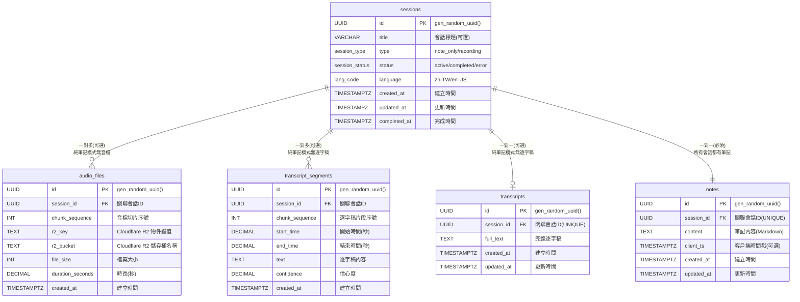
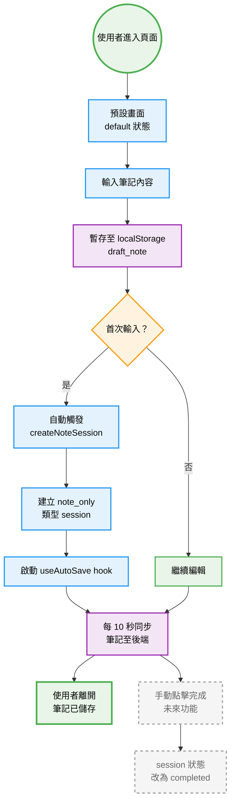

# Technical Specification


## Frontend Stack

- pnpm for Package manager
- React 18 with TypeScript
- Next.js for framework
- Tailwind CSS + shadcn/ui components
- Zustand-like context for state management
- Zod 4, therefore the imports should be `from "zod/v4"`, you may fetch `https://zod.dev/v4/changelog` if you are unsure how to write.
- Playwright MCP for e2e test

```ts
// Bad: Zod 3
import { z } from 'zod';
z.object({ name: z.string() }).strict();
z.object({ name: z.string() }).passthrough();

// Good: Zod 4
import { z } from 'zod/v4';
z.strictObject({ name: z.string() });
z.looseObject({ name: z.string() });
```


## Backend Stack

- Python version 3.10+
  - Use `uv` for virtual environment management
  - Pin all dependency versions in requirements.txt or pyproject.toml
- Separate production and development dependencies
- FastAPI for web framework with async support
- Pydantic v2 for data validation and settings management
- Supabase as database
- Azure OpenAI for transcription services
- WebSocket for real-time communication
- Cloudflare R2 for audio storage
- FFmpeg for audio processing


## File Structure

- Frontend File organization
  - Components in `frontend/components/(ui)/`
  - Custom hooks in `frontend/hooks/`
  - Utilities in `frontend/lib/`
  - Type definitions in `frontend/types/`
  - Services in `frontend/lib/services/`
  - Constants in `frontend/constants/`


- Backend File organization
  - Models in `app/schemas/`
  - Services in `app/services/`
  - API routes in `app/api/`
  - Core utilities in `app/core/`
  - Database related in `app/db/`
  - WebSocket handlers in `app/ws/`
  


### 1. 後端 FastAPI (簡化架構 - REST API 模式)

| #     | 函式 / 協程                                              | 所屬模組              | 責任                                         | I/O                                                |
| ----- | -------------------------------------------------------- | --------------------- | -------------------------------------------- | -------------------------------------------------- |
| B-001 | `create_session(title:str=None, type:str) -> SessionOut` | api.sessions          | POST /api/session                            | in: type, title(可選)；out: sid, status, type      |
| B-002 | `finish_session(sid:UUID)`                               | api.sessions          | PATCH /api/session/{sid}/finish              | in: sid；204                                       |
| B-015 | `upgrade_session_to_recording(sid:UUID)`                 | api.sessions          | PATCH /api/session/{sid}/upgrade             | in: sid；out: updated session                      |
| B-003 | `save_note(sid:UUID, content:str, client_ts:datetime)`   | api.notes             | PUT /api/notes/{sid}                         | in: content, client_ts(可選)；out: server_ts, note |
| B-004 | `export_resource(sid:UUID, type:str)`                    | api.export            | GET /api/export/{sid}?type=                  | StreamingResponse                                  |
| B-020 | `upload_segment(sid:UUID, seq:int, file:UploadFile)`     | api.segments          | POST /api/segment - 上傳 10s WebM 音檔切片   | in: WebM file；out: {"ack": seq}                   |
| B-006 | `ws_transcript_feed(ws:WebSocket, sid:UUID)`             | ws.transcript_feed    | 推送 Azure OpenAI 逐字稿結果                 | ↓ {"text","timestamp",...}                         |
| B-007 | `store_segment_blob(sid, seq, blob)`                     | services.storage      | 上傳到 Cloudflare R2 + 更新 DB `audio_files` | —                                                  |
| B-021 | `ffmpeg_webm_to_pcm(webm_bytes) -> bytes`                | core.ffmpeg           | WebM→16k mono PCM (處理完整 10s 檔案)        | in: WebM blob；out: PCM bytes                      |
| B-010 | `azure_openai_client() -> OpenAI`                        | services.azure_openai | 建立 Azure OpenAI 客戶端                     | return client                                      |
| B-022 | `whisper_transcribe(pcm_bytes) -> str`                   | services.azure_openai | 單檔轉錄：WebM/PCM → Azure OpenAI Whisper    | in: audio bytes；out: transcript text              |
| B-023 | `process_and_transcribe(sid, seq, webm)`                 | api.segments          | 背景任務：轉檔 + STT + 儲存 + 廣播           | BackgroundTasks                                    |
| B-013 | `mark_session_error(sid, reason)`                        | db.crud               | 更新 sessions.status=error                   | —                                                  |
| B-014 | `single_active_guard()`                                  | middleware            | 保證同時僅 1 active session                  | 429 on violation                                   |
| B-016 | `check_tables_exist()`                                   | db.database           | 檢查核心表格是否存在                         | return bool                                        |
| B-017 | `auto_init_database()`                                   | db.database           | 自動檢測並初始化資料庫                       | 啟動時執行                                         |
| B-018 | `init_r2_client() -> S3Client`                           | services.r2_client    | 初始化 Cloudflare R2 客戶端                  | return S3Client                                    |
| B-019 | `generate_r2_presigned_url(bucket, key, expires)`        | services.r2_client    | 生成 R2 預簽名 URL                           | return presigned_url                               |

### ⚠️ 移除的功能 (簡化架構)
- ❌ `ws_upload_audio` - 改用 REST API
- ❌ `handle_ack_missing` - 不再需要 chunk ack/missing 機制
- ❌ `ffmpeg_spawn` - 改為處理完整檔案，不需要串流
- ❌ `transcribe_audio_batch` - 改為單檔處理

### 2. 前端 React（Hook / Utility）

| #     | 函式                                 | 模組                | 責任                                                                                       | I/O                                                                          |
| ----- | ------------------------------------ | ------------------- | ------------------------------------------------------------------------------------------ | ---------------------------------------------------------------------------- |
| F-001 | `useAppState.setState(state)`        | hooks/useAppState   | 管理前端應用狀態轉換                                                                       | 'default'\|'recording_waiting'\|'recording_active'\|'processing'\|'finished' |
| F-002 | `useSession.createNoteSession()`     | hooks/useSession    | POST /session (type=note_only)                                                             | return sid                                                                   |
| F-003 | `useSession.upgradeToRecording(sid)` | hooks/useSession    | PATCH /session/{sid}/upgrade                                                               | return updated session                                                       |
| F-004 | `useRecorder.startRecording()`       | hooks/useRecorder   | a. 建立/升級 session<br>b. 狀態轉為 recording_waiting<br>c. 啟 MediaRecorder timeslice=10s | return sid                                                                   |
| F-005 | `useRecorder.stopRecording()`        | hooks/useRecorder   | a. 停止錄音<br>b. 狀態轉為 processing<br>c. 等待轉錄完成                                   | —                                                                            |
| F-024 | `uploadSegment(seq, blob)`           | hooks/useRecorder   | fetch POST /api/segment 上傳 10s WebM 檔案                                                 | —                                                                            |
| F-025 | `handleUploadError(seq, blob)`       | hooks/useRecorder   | 上傳失敗處理，暫存到 IndexedDB                                                             | —                                                                            |
| F-008 | `useTranscript.connect(sid)`         | hooks/useTranscript | 建 `/ws/transcript_feed` 連線                                                              | —                                                                            |
| F-009 | `mergeSegment(seg)`                  | hooks/useTranscript | 相鄰 ≤1 s 合併段落                                                                         | 更新 segments state                                                          |
| F-010 | `onTranscriptComplete()`             | hooks/useTranscript | 轉錄完成回調，狀態轉為 finished                                                            | —                                                                            |
| F-011 | `autoScroll()`                       | hooks/useTranscript | 若鎖定到底則捲底                                                                           | —                                                                            |
| F-012 | `unlockOnScroll()`                   | hooks/useTranscript | 使用者滾動離底 >60 px                                                                      | set locked=false                                                             |
| F-013 | `toLatest()`                         | hooks/useTranscript | smooth scroll bottom；鎖定                                                                 | —                                                                            |
| F-014 | `useLocalDraft(field,val)`           | hooks/useLocalDraft | 5 s debounce 存 localStorage                                                               | —                                                                            |
| F-015 | `loadDraft()`                        | hooks/useLocalDraft | 載入 draft_note                                                                            | return {note}                                                                |
| F-016 | `clearDraft()`                       | hooks/useLocalDraft | removeItem('draft_*')                                                                      | —                                                                            |
| F-017 | `useAutoSave(sid, content)`          | hooks/useAutoSave   | 每 10 s PUT /notes                                                                         | —                                                                            |
| F-018 | `newNote()`                          | hooks/useAppState   | 清空當前資料，狀態回到 default<br>如果存在活躍會話，先刪除該會話及其所有相關數據           | —                                                                            |
| F-019 | `downloadZip(sid)`                   | utils/export        | GET /export/{sid}?type=zip                                                                 | 觸發 download                                                                |
| F-020 | `showToast(text,type)`               | utils/ui            | 統一錯誤／提示                                                                             | —                                                                            |

### 3. 前端 UI Component Methods（狀態對應）

| #     | 元件                | 出現狀態                                                  | 主要方法 / callback                    |
| ----- | ------------------- | --------------------------------------------------------- | -------------------------------------- |
| C-001 | `RecordButton`      | default, recording_waiting, recording_active              | `onClick => startRecording()           | stopRecording()` |
| C-002 | `MarkdownEditor`    | default, recording_waiting, recording_active, finished    | `onChange => saveDraft() / autoSave()` |
| C-003 | `TranscriptPane`    | recording_waiting, recording_active, processing, finished | `onScroll => unlockOnScroll()`         |
| C-004 | `ToLatestButton`    | recording_waiting, finished                               | `onClick => toLatest()`                |
| C-005 | `ProcessingOverlay` | processing                                                | 顯示轉錄進度與等待動畫                 |
| C-006 | `ExportButton`      | finished                                                  | `onClick => downloadZip()`             |
| C-007 | `NewNoteButton`     | finished                                                  | `onClick => newNote()`                 |
| C-008 | `StatusIndicator`   | all states                                                | 顯示當前狀態（錄音中/處理中/已完成）   |

**各狀態畫面組成**：

| 狀態              | 顯示元件                                                                              |
| ----------------- | ------------------------------------------------------------------------------------- |
| default           | MarkdownEditor + RecordButton + NewNoteButton                                         |
| recording_waiting | MarkdownEditor + TranscriptPane + NewNoteButton + RecordButton(停止) + ToLatestButton |
| recording_active  | MarkdownEditor + TranscriptPane + NewNoteButton + RecordButton(停止) + ToLatestButton |
| processing        | MarkdownEditor + TranscriptPane + ProcessingOverlay                                   |
| finished          | MarkdownEditor + TranscriptPane + ExportButton + NewNoteButton + ToLatestButton       |

**NewNoteButton 在不同狀態的行為**：

| 狀態              | NewNoteButton 行為       | 說明                                                                                           |
| ----------------- | ------------------------ | ---------------------------------------------------------------------------------------------- |
| default           | 清空當前會話並開始新筆記 | 如果存在活躍會話，會先刪除該會話及其所有相關數據；清空編輯器內容和本地草稿；狀態保持在 default |
| recording_waiting | 停止錄音並清空當前會話   | 停止錄音，刪除當前會話及其所有相關數據，回到 default 狀態                                      |
| recording_active  | 停止錄音並清空當前會話   | 停止錄音，刪除當前會話及其所有相關數據，回到 default 狀態                                      |
| finished          | 清空當前會話並開始新筆記 | 刪除已完成的會話及其所有相關數據，清空編輯器內容，回到 default 狀態                            |

### 4. Supabase PostgreSQL 資料庫架構

**架構特色**：
- ✅ **雲端原生**：專為 Supabase 設計，享受完整雲端服務
- ✅ **檔案分離**：音訊檔案使用免費的 Cloudflare R2 儲存，降低成本
- ✅ **自動初始化**：提供完整 SQL 腳本，一鍵建立所有表格
- ✅ **高可用性**：Supabase 提供 99.9% 可用性保證


```Mermaid

sequenceDiagram
    %% ==== Participants ====
    actor User as 👤 使用者
    participant Browser as 🌐 瀏覽器
    participant BE as ⚡ FastAPI
    participant R2 as ☁️ R2 Storage
    participant DB as 💾 Supabase
    participant STT as 🤖 STT Model
    participant WS as 🔌 Websocket

    %% ==== 即時錄音流程 ====
    rect rgb(240,248,255)
        Note over User,WS: 🎙️ 即時錄音與轉錄
        User ->> Browser: 點擊開始錄音
        Browser ->>+ BE: 開新 Session 

        par 儲存與轉錄
            BE ->>+ R2: 儲存 WebM
            BE ->>+ STT: WebM → Whisper
            STT -->> BE: 回覆 Transcript JSON
            BE -->> WS: 傳入逐字稿
            BE ->>+ DB: INSERT transcript_segments
        end

        WS -->> Browser: 送出逐字稿
        Browser -->> User: 更新逐字稿
    end
        WS -->> Browser: 送出逐字稿
        Browser -->> User: 更新逐字稿
    end

    %% ==== 匯出功能 ====
    rect rgb(248,255,248)
        Note over User,WS: 📥 匯出筆記與逐字稿
        User ->> Browser: 點擊匯出
        Browser ->>+ BE: GET /api/export?type=zip
        BE ->>+ DB: SELECT note & transcript
        DB -->>- BE: 文字內容
        BE ->>+ R2: 讀取音訊檔案
        R2 -->>- BE: WebM files
        BE -->>- Browser: ZIP 檔案
        Browser -->> User: 下載完成
    end

```



### 5. 前端狀態管理

**前端應用狀態 (AppState)**：
```typescript
type AppState = 
  | 'default'           // 預設畫面：可寫筆記，顯示錄音按鈕
  | 'recording_waiting' // 錄音中，尚未收到逐字稿
  | 'recording_active'  // 錄音中，已收到逐字稿並即時顯示
  | 'processing'        // 處理畫面：停止錄音後，處理剩餘逐字稿
  | 'finished'          // 完整逐字稿畫面：可編輯筆記、匯出、開新筆記
```

**狀態轉換規則**：
```
default → recording_waiting           // 按下錄音按鈕
recording_waiting → recording_active  // 收到第一段逐字稿
recording_active → processing         // 按下停止錄音
processing → finished                 // 逐字稿處理完成
finished → default                    // 按下 New note
default → finished                    // 純筆記模式直接完成（未來功能）
```

**各狀態功能對照**：

| 狀態              | 筆記編輯 | 錄音功能 | 逐字稿顯示 | 匯出功能 | 特殊功能   |
| ----------------- | -------- | -------- | ---------- | -------- | ---------- |
| default           | ✅ 可編輯 | ✅ 可開始 | ❌ 無       | ❌ 無     | draft 暫存 |
| recording_waiting | ✅ 可編輯 | ✅ 可停止 | ⏳ 等待中   | ❌ 無     | 計時器     |
| recording_active  | ✅ 可編輯 | ✅ 可停止 | ✅ 即時顯示 | ❌ 無     | 音檔上傳   |
| processing        | ❌ 鎖定   | ❌ 無     | ✅ 更新中   | ❌ 無     | 等待動畫   |
| finished          | ✅ 可編輯 | ❌ 無     | ✅ 完整顯示 | ✅ 可匯出 | New note   |

**後端 Session 狀態對應**：

| 前端狀態          | 後端 Session Status | Session Type        | 說明                           |
| ----------------- | ------------------- | ------------------- | ------------------------------ |
| default           | draft               | note_only           | 草稿狀態，尚未正式建立 session |
| default (已建立)  | active              | note_only           | 純筆記 session                 |
| recording_waiting | active              | recording           | 錄音中，尚未收到逐字稿         |
| recording_active  | active              | recording           | 錄音中，已收到逐字稿並即時顯示 |
| processing        | active              | recording           | 錄音結束，轉錄處理中           |
| finished          | completed           | note_only/recording | 可匯出完整資料                 |

### 6. Azure OpenAI 整合架構 (REST API 簡化版)

**技術選擇理由**：
- ✅ **企業級品質**：Azure OpenAI 提供穩定的 Whisper 模型服務
- ✅ **多語言支援**：優秀的中文語音識別準確度
- ✅ **API 整合**：標準 OpenAI SDK，開發簡單
- ✅ **資料安全**：Microsoft 提供企業級資料保護
- ✅ **架構簡化**：使用完整 10s 檔案，提高成功率

**工作流程**：
```
前端錄音 (10s WebM) → REST API 上傳完整檔案 → 儲存到 R2 → 
FFmpeg 轉換 → Azure OpenAI Whisper API → WebSocket 推送轉錄結果
```

---

## 8. 使用場景與狀態流程

### 場景 1：純筆記模式（不錄音）

- **目標**：讓使用者能快速開始做筆記，無需進行繁瑣的設定。
- **流程**：
  1. **進入頁面**：使用者打開應用，看到預設畫面（`default` 狀態）。
  2. **輸入內容**：
     - 在 `MarkdownEditor` 中輸入筆記，內容暫存於 `localStorage`（`draft_note`）。
  3. **建立會話**：
     - 使用者首次輸入時，自動觸發 `createNoteSession()`，在後端建立一個 `note_only` 類型的 session。
     - 成功後，`useAutoSave` hook 啟動，每 10 秒將筆記內容同步到後端。
  4. **完成筆記**：
     - 使用者可以隨時離開，筆記已儲存。
     - （未來功能）可手動點擊「完成」，將 session 狀態改為 `completed`。



### 場景 2：先筆記後錄音

- **目標**：允許使用者在已有筆記的基礎上，隨時開始錄音。
- **流程**：
  1. **開始筆記**：同「場景 1」，使用者已建立一個 `note_only` 會話並有一些筆記內容。
  2. **點擊錄音**：使用者點擊 `RecordButton`。
  3. **升級會話**：
     - 呼叫 `upgradeToRecording()`，將後端 session type 從 `note_only` 改為 `recording`。
     - 前端狀態從 `default` 轉為 `recording_waiting`。
  4. **開始錄音**：同「場景 3」的錄音流程。

### 場景 3：邊錄邊記模式

- **目標**：提供最核心的「錄音 + 即時逐字稿 + 筆記」整合體驗。
- **流程**：
  1. **建立會話**：
     - 使用者在 `default` 狀態下，直接點擊 `RecordButton`。
     - 呼叫 `createRecordingSession()` 建立 `recording` 類型的 session。
     - 前端狀態立即轉為 `recording_waiting`。
  2. **錄音與上傳**：
     - `MediaRecorder` 開始錄音，使用 `timeslice=10000`，每 10 秒產生一個完整 WebM 檔案。
     - `ondataavailable` 事件觸發，使用 `fetch` POST 到 `/api/segment` 上傳檔案。
     - 後端立即回應 `{"ack": seq}`，前端處理錯誤時暫存到 IndexedDB。
  3. **即時逐字稿**：
     - `ws_transcript_feed` WebSocket 連線建立。
     - 後端收到檔案後，在背景執行 FFmpeg 轉換 + Whisper API 轉錄。
     - Whisper API 返回轉錄結果，後端透過 WebSocket 推送給前端。
     - `TranscriptPane` 每 10 秒收到一批逐字稿片段。
  4. **同步筆記**：
     - 使用者可以在 `MarkdownEditor` 中隨時輸入筆記，`useAutoSave` 會定期儲存。
  5. **停止錄音**：
     - 使用者點擊 `RecordButton` (此時為停止圖示)。
     - `stopRecording()` 被呼叫，`MediaRecorder` 停止。
     - 前端狀態轉為 `processing`。
  6. **等待轉錄完成**：
     - `ProcessingOverlay` 顯示，鎖定編輯區。
     - 後端處理剩餘的音檔切片，並將最後的逐字稿推送回來。
  7. **完成**：
     - 當後端推送 `transcript_complete` 訊息時，前端狀態轉為 `finished`。
     - `ProcessingOverlay` 消失，使用者可以檢視完整逐字稿、編輯筆記、並匯出。
  8. **匯出與新筆記**：
     - `ExportButton` 可用，點擊下載包含 `.mp4`、`transcript.txt` 和 `note.md` 的 ZIP 檔。
     - `NewNoteButton` 可用，點擊清空當前畫面，回到 `default` 狀態，開始新的筆記。
