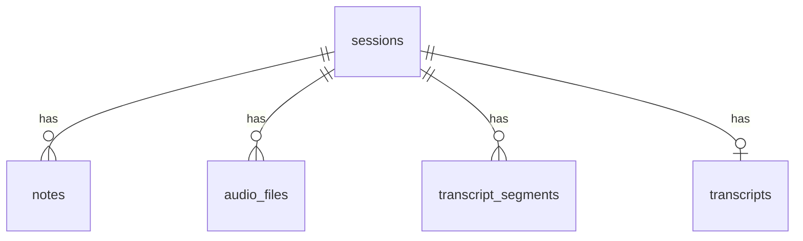

# StudyScriber Spec

## 1. 專案簡介
StudyScriber 為一款「即時錄音＋語音轉文字＋筆記」的雲端 SaaS 服務，鎖定教師、學生及專業工作者。核心價值在於：
* 低延遲、高品質的即時逐字稿
* 斷線自動補傳
* 多語系、多 STT 引擎切換
* 一鍵匯出 Markdown／TXT

## 2. 名詞定義
| 名詞               | 說明                                      |
| ------------------ | ----------------------------------------- |
| Session            | 使用者的一次錄音流程                      |
| Segment            | 一段固定長度 (預設 30 s) 的 WebM 音訊切片 |
| Transcript Segment | STT 針對單一 Segment 回傳的逐字稿         |
| Note               | 使用者於錄音過程輸入的 Markdown 筆記      |
| Provider           | 轉錄引擎；目前支援 Whisper / GPT-4o       |

## 3. Tech Stack

### Frontend

#### 框架
React 19 + Next.js 15

#### 語言
TypeScript

#### 套件管理
pnpm

#### 樣式
Tailwind CSS + shadcn/ui

#### 狀態管理
Zustand + React Context + State Machine

#### API 客戶端
Axios

#### 測試
Vitest + Playwright

#### 音訊錄製
MediaRecorder API

### Backend

#### 框架
FastAPI

#### 語言
Python 3.12+

#### 環境管理
uv

#### 資料庫
Supabase (PostgreSQL)

#### 即時通訊
WebSocket

#### 檔案儲存
Cloudflare R2

#### STT 服務
Azure OpenAI (Whisper), Azure GPT-4o

#### 音訊處理
FFmpeg

#### 資料驗證
Pydantic v2

---

## 4. 系統架構

### 4.1 整體架構圖


### 4.2 前端架構
1. **UI 層**：shadcn/ui 組件＋Tailwind  
2. **狀態管理層**：Zustand Store 為單一資料來源；XState 控制錄音狀態機  
3. **服務層**：`SessionService`, `RecordingService`, `TranscriptService` 採依賴注入  
4. **適配器**：舊 hook 與新服務平行存在，透過 Feature Flag 切換  
5. **離線機制**：`IndexedDBAudioCache` 暫存失敗片段，恢復網路時自動補傳  

### 4.3 後端架構
1. **API 層**：FastAPI Router；所有 I/O 使用 `async`  
2. **STT Factory**：`stt.factory.get_provider(session.stt_provider)`  
3. **背景 Worker**：`asyncio.create_task` + `PriorityQueue`  
4. **VAD**：若判定 `silence_ratio > 98 %` 直接丟棄該 Segment  
5. **WebSocket Hub**：依 `session_id` 分房間廣播  

---

## 5. 資料庫設計

### 5.1 ER 圖


### 5.2 資料表定義（精簡）
| Table               | 主要欄位                                                        | 備註 |
| :------------------ | :-------------------------------------------------------------- | :--- |
| sessions            | id (UUID PK), status, title, stt_provider, created_at           |      |
| notes               | id, session_id FK, content, client_ts                           |      |
| audio_files         | id, session_id FK, chunk_sequence, r2_key, duration_seconds     |      |
| transcript_segments | id, session_id FK, chunk_sequence, start_time, text, confidence |      |
| transcripts         | id, session_id UNIQUE, full_text                                |      |

---

## 6. API 規格

### 6.1 HTTP Endpoints
| Method | Path                  | 描述              | 回傳                |
| :----- | :-------------------- | :---------------- | :------------------ |
| POST   | /api/session          | 建立 Session      | 201 + Session JSON  |
| GET    | /api/session/{sid}    | 取得 Session 狀態 | 200                 |
| POST   | /api/segment          | 上傳音訊切片      | 201                 |
| POST   | /api/notes            | 新增／更新筆記    | 200                 |
| POST   | /api/notes/export     | 產生並下載 ZIP    | 200 (Streaming ZIP) |
| GET    | /api/transcript/{sid} | 取得完整逐字稿    | 200                 |

### 6.2 WebSocket
| Path                | 事件                  | Payload                        |
| ------------------- | --------------------- | ------------------------------ |
| /ws/transcript_feed | `segment_transcribed` | `{text, start_time, end_time}` |
|                     | `transcript_complete` | `{session_id}`                 |

---

## 7. 核心功能規格

### 7.1 錄音與上傳
* Segment 長度：30 s (可透過 `.env` 調整)  
* 檔案格式：WebM / Opus，24 kHz  
* 上傳失敗重試：指數退避，最長 5 分鐘；失敗則寫入 IndexedDB  

### 7.2 語音轉文字
* Provider 由前端建立 Session 時指定  
* Whisper 最高支援 25 MB／request；大檔案自動分片  
* GPT-4o / Gemini：依 API 限制自動抽樣 16 kHz  

### 7.3 狀態管理
| 狀態       | 事件 (=> 下一狀態)           |
| ---------- | ---------------------------- |
| idle       | `START_RECORD` ⇒ waiting     |
| waiting    | `MEDIA_READY` ⇒ recording    |
| recording  | `STOP` ⇒ processing          |
| processing | `TRANSCRIPT_DONE` ⇒ finished |

### 7.4 匯出功能
* Note 內容由前端送入，避免競態  
* ZIP 內容：`note.md`、`transcript.txt`  
* `Content-Disposition`：`attachment; filename="studyscriber_{provider}_{yyyyMMdd}_{sid4}.zip"`  

### 7.5 流程時序圖

#### 7.5.1 錄音→轉錄


#### 7.5.2 匯出 ZIP
```mermaid
sequenceDiagram
    actor 使用者
    participant 前端
    participant 後端
    participant DB

    使用者 ->> 前端: 點擊「匯出」
    前端 ->> 後端: POST /api/notes/export
    後端 ->> DB: SELECT transcript_segments
    後端: 組 ZIP(note.md + transcript.txt)
    後端 -->> 前端: StreamingResponse
    前端 ->> 使用者: 觸發下載
```

---

## 8. 錯誤處理與重試機制
| 類型     | 前端策略                 | 後端策略                                   |
| -------- | ------------------------ | ------------------------------------------ |
| 上傳失敗 | IndexedDB 暫存；5 × 重試 | 4xx 回傳錯誤代碼                           |
| STT 逾時 | 顯示「正在處理」並續傳   | Worker 3 × 重試；失敗標記 `segment_failed` |
| WS 中斷  | 3 × 自動重連             | idempotent broadcast                       |

## 9. 測試策略
| 層級 | 工具            | 覆蓋範圍       |
| ---- | --------------- | -------------- |
| 單元 | Vitest / pytest | 函式 & 元件    |
| 整合 | Playwright      | 錄音→轉錄→匯出 |
