# StudyScriber Spec

## 1. 專案簡介
StudyScriber 為一款「即時錄音＋語音轉文字＋筆記」的雲端 SaaS 服務，鎖定教師、學生及專業工作者。核心價值在於：
* 低延遲、高品質的即時逐字稿
* 斷線自動補傳
* 多語系、多 STT 引擎切換
* 一鍵匯出 Markdown／TXT

## 2. 名詞定義
| 名詞               | 說明                                      |
| ------------------ | ----------------------------------------- |
| Session            | 使用者的一次錄音流程                      |
| Segment            | 一段固定長度 (預設 30 s) 的 WebM 音訊切片 |
| Transcript Segment | STT 針對單一 Segment 回傳的逐字稿         |
| Note               | 使用者於錄音過程輸入的 Markdown 筆記      |
| Provider           | 轉錄引擎；目前支援 Whisper / GPT-4o       |

## 3. Tech Stack

### Frontend

#### 框架
React 19 + Next.js 15

#### 語言
TypeScript

#### 套件管理
pnpm

#### 樣式
Tailwind CSS + shadcn/ui

#### 狀態管理
Zustand + React Context + State Machine

#### API 客戶端
Axios

#### 測試
Vitest + Playwright

#### 音訊錄製
MediaRecorder API

### Backend

#### 框架
FastAPI

#### 語言
Python 3.12+

#### 環境管理
uv

#### 資料庫
Supabase (PostgreSQL)

#### 即時通訊
WebSocket

#### 檔案儲存
Cloudflare R2

#### STT 服務
Azure OpenAI (Whisper), Azure GPT-4o

#### 音訊處理
FFmpeg

#### 資料驗證
Pydantic v2

---

## 4. 系統架構

### 4.1 整體架構圖

```mermaid
graph TD
    subgraph "🌐 前端"
        FE[Next.js App] --> Store[Zustand Store]
        FE --> Services[Service Layer]
    end
    subgraph "⚡ 後端"
        API[REST /api/*] --> Worker[Background Workers]
        WS[WebSocket /ws/transcript_feed] --> FE
        Worker --> STT
    end
    subgraph "☁️ 雲端"
        STT[Whisper / GPT-4o / Gemini]
        DB[(Supabase)]
        R2[(Cloudflare R2)]
    end
    Services --HTTP--> API
    Worker --SQL--> DB
    Worker --S3--> R2
```

### 4.2 前端架構
1. **UI 層**：shadcn/ui 組件＋Tailwind  
2. **狀態管理層**：Zustand Store 為單一資料來源；XState 控制錄音狀態機  
3. **服務層**：`SessionService`, `RecordingService`, `TranscriptService` 採依賴注入  
4. **適配器**：舊 hook 與新服務平行存在，透過 Feature Flag 切換  
5. **離線機制**：`IndexedDBAudioCache` 暫存失敗片段，恢復網路時自動補傳  

### 4.3 後端架構
1. **API 層**：FastAPI Router；所有 I/O 使用 `async`  
2. **STT Factory**：`stt.factory.get_provider(session.stt_provider)`  
3. **背景 Worker**：`asyncio.create_task` + `PriorityQueue`  
4. **VAD**：若判定 `silence_ratio > 98 %` 直接丟棄該 Segment  
5. **WebSocket Hub**：依 `session_id` 分房間廣播  

### 4.4 資料夾架構

-  **app/**Python 後端核心
   -  **api/**：FastAPI 路由（export、notes、segments、sessions）
   -  **core/**：音訊處理與系統設定（VAD、FFmpeg、WebM 修復…）
   -  **db/**：資料庫／Supabase 初始設定
   -  **lib/**：重通用、低耦合，可外部共用工具（timeout、rate-limit 等）
   -  **schemas/**：Pydantic 資料模型 (export, note, session)
   -  **services/**：第三方服務封裝（Azure OpenAI、Whisper、R2、STT provider 工廠…）
   -  **utils/**：本專案小工具、驗證器、計時器
   -  **ws/**：WebSocket 事件（transcript feed、音訊上傳）

-  **frontend/**（Next.js + TypeScript 前端）
  - **app/**：Next.js 頁面 & 佈局
  - **components/**：UI 元件（含 shadcn/ui 及自訂狀態元件）
  - **hooks/**、**lib/**、**utils/**：前端商業邏輯與工具
  - **e2e/**：Playwright 前端端對端測試
  - **constants/**、**types/**：靜態設定與型別定義

-  **e2e/**（後端端對端測試，TS 撰寫，對 API 進行驗證）
-  **docs/**（專案規格與技術說明 Markdown，如 skip-silence-spec.md 等）
-  **tests/** Python 單元／整合測試
-  **main.py** 主要程式，啟動測試

-  **其他根目錄檔案**
  - **pyproject.toml**：Python 依賴與設定
  - **PRD.md**, **SPEC.md**：產品需求 & 系統規格
  - **playwright.config.ts**, **vitest.config.ts**：測試框架設定
  - **package.json**、**pnpm-lock.yaml**：前端依賴

---

## 5. 資料庫設計

### 5.1 資料表定義
| Table               | 主要欄位                                                        | 備註 |
| :------------------ | :-------------------------------------------------------------- | :--- |
| sessions            | id (UUID PK), status, title, stt_provider, created_at           |      |
| notes               | id, session_id FK, content, client_ts                           |      |
| audio_files         | id, session_id FK, chunk_sequence, r2_key, duration_seconds     |      |
| transcript_segments | id, session_id FK, chunk_sequence, start_time, text, confidence |      |
| transcripts         | id, session_id UNIQUE, full_text                                |      |

---

## 6. API 規格

### 6.1 HTTP Endpoints
| Method | Path                  | 描述              | 回傳                |
| :----- | :-------------------- | :---------------- | :------------------ |
| POST   | /api/session          | 建立 Session      | 201 + Session JSON  |
| GET    | /api/session/{sid}    | 取得 Session 狀態 | 200                 |
| POST   | /api/segment          | 上傳音訊切片      | 201                 |
| POST   | /api/notes            | 新增／更新筆記    | 200                 |
| POST   | /api/notes/export     | 產生並下載 ZIP    | 200 (Streaming ZIP) |
| GET    | /api/transcript/{sid} | 取得完整逐字稿    | 200                 |

### 6.2 WebSocket
| Path                | 事件                  | Payload                        |
| ------------------- | --------------------- | ------------------------------ |
| /ws/transcript_feed | `segment_transcribed` | `{text, start_time, end_time}` |
|                     | `transcript_complete` | `{session_id}`                 |

---

## 7. 核心功能規格

### 7.1 錄音與上傳
* Segment 長度：30 s (可透過 `.env` 調整)  
* 檔案格式：WebM / Opus，24 kHz  
* 上傳失敗重試：指數退避，最長 5 分鐘；失敗則寫入 IndexedDB  

### 7.2 語音轉文字
* Provider 用選單選擇  
* Whisper 最高支援 25 MB／request；大檔案自動分片  
* GPT-4o / Whisper：依 API 限制自動抽樣 16 kHz  

### 7.3 狀態管理
| 狀態       | 事件 (=> 下一狀態)           |
| ---------- | ---------------------------- |
| idle       | `START_RECORD` ⇒ waiting     |
| waiting    | `MEDIA_READY` ⇒ recording    |
| recording  | `STOP` ⇒ processing          |
| processing | `TRANSCRIPT_DONE` ⇒ finished |

### 7.4 匯出功能
* Note 內容由前端送入，避免競態  
* ZIP 內容：`note.md`、`transcript.txt`  
* `Content-Disposition`：`attachment; filename="studyscriber_{provider}_{yyyyMMdd}_{sid4}.zip"`  

### 7.5 流程時序圖

#### 7.5.1 錄音→轉錄

```mermaid
sequenceDiagram
    actor 使用者
    participant 前端
    participant 後端
    participant DB
    participant R2
    participant STT
    participant WS

    使用者 ->> 前端: 點擊「開始錄音」
    前端 ->> 後端: POST /api/session
    後端 ->> DB: INSERT session
    DB -->> 後端: sid
    後端 -->> 前端: 201 sid
    前端 ->> WS: connect /ws/transcript_feed

    loop 每 30 s
        前端 ->> 後端: POST /api/segment
        par 儲存
            後端 ->> R2: PUT object
            後端 ->> DB: INSERT audio_files
        and 轉錄
            後端 ->> STT: 調用 API
            STT -->> 後端: text
            後端 ->> DB: INSERT transcript_segments
            後端 ->> WS: push segment_transcribed
            WS -->> 前端: event
        end
        前端 ->> 使用者: UI 顯示文字
    end

    使用者 ->> 前端: 停止錄音
    後端 ->> WS: transcript_complete
```

#### 7.5.2 匯出 ZIP

```mermaid
sequenceDiagram
    actor 使用者
    participant 前端
    participant 後端
    participant DB

    使用者 ->> 前端: 點擊「匯出」
    前端 ->> 後端: POST /api/notes/export
    後端 ->> DB: SELECT transcript_segments
    DB -->> 後端: 回傳資料
    後端 ->> 後端: 組 ZIP(note.md + transcript.txt)
    後端 -->> 前端: StreamingResponse
    前端 ->> 使用者: 觸發下載

    %% 樣式定義
    %%{init: {'theme':'base', 'themeVariables': { 'primaryColor': '#e3f2fd', 'primaryTextColor': '#000', 'primaryBorderColor': '#2196f3', 'lineColor': '#666', 'secondaryColor': '#f5f5f5', 'tertiaryColor': '#fff'}}}%%

```

---

## 8. 錯誤處理與重試機制
| 類型     | 前端策略                 | 後端策略                                   |
| -------- | ------------------------ | ------------------------------------------ |
| 上傳失敗 | IndexedDB 暫存；5 × 重試 | 4xx 回傳錯誤代碼                           |
| STT 逾時 | 顯示「正在處理」並續傳   | Worker 3 × 重試；失敗標記 `segment_failed` |
| WS 中斷  | 3 × 自動重連             | idempotent broadcast                       |

## 9. 測試策略
| 層級 | 工具            | 覆蓋範圍       |
| ---- | --------------- | -------------- |
| 單元 | Vitest / pytest | 函式 & 元件    |
| 整合 | Playwright      | 錄音→轉錄→匯出 |
